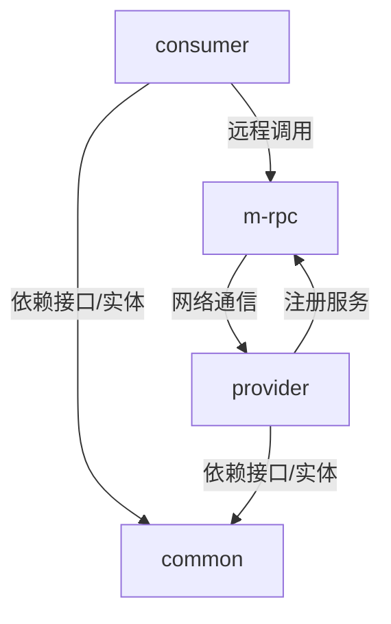
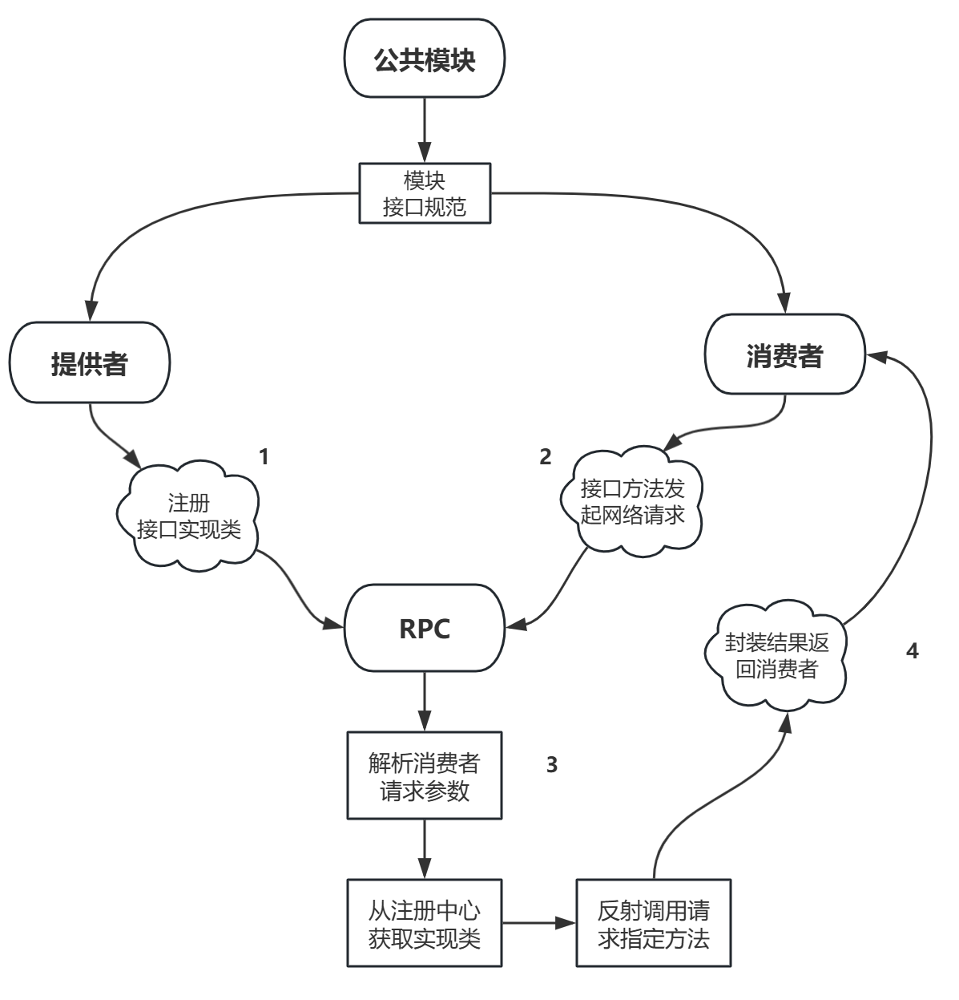

# z-rpc —— 手写简易RPC框架

## 项目简介

`z-rpc` 是一个基于 Java 实现的简易 RPC（Remote Procedure Call，远程过程调用）框架，旨在帮助理解分布式服务调用的底层原理。项目采用模块化设计，包含 `common`、`provider`、`consumer`、`m-rpc` 四个核心模块，分别负责接口定义、服务提供、服务消费和RPC核心功能实现。

---

## 项目结构

```
z-rpc/
  ├── common/      # 公共模块，定义接口与通用实体
  ├── provider/    # 服务提供者，实现具体服务
  ├── consumer/    # 服务消费者，远程调用服务
  └── m-rpc/       # RPC核心模块，通信、序列化、注册中心等
```

---

## 各模块功能说明

### 1. common

- **功能**：定义服务接口、通用实体类，供 `provider` 和 `consumer` 依赖。
- **主要内容**：
  - `model/`：如 `User.java`，定义数据结构。
  - `service/`：如 `UserService.java`，定义服务接口。

### 2. provider

- **功能**：服务提供者，实现 `common` 中定义的接口，并通过RPC框架对外暴露服务。
- **主要内容**：
  - `impl/`：如 `UserServiceImpl.java`，实现具体服务逻辑。
  - `ProviderApplication.java`：服务启动入口，注册服务到注册中心。

### 3. consumer

- **功能**：服务消费者，通过RPC框架远程调用 `provider` 提供的服务。
- **主要内容**：
  - `proxy/`：如 `ServiceProxy.java`，实现动态代理，封装远程调用逻辑。
  - `ConsumerApplication.java`：消费端启动入口，发起远程调用。

### 4. m-rpc

- **功能**：RPC框架核心，负责网络通信、序列化、注册中心等基础能力。
- **主要内容**：
  - `model/`：如 `RpcRequest.java`、`RpcResponse.java`，定义RPC请求/响应结构。
  - `server/`：如 `HttpServer.java`，实现RPC服务端。
  - `serializer/`：如 `Serializer.java`，实现序列化与反序列化。
  - `registry/`：如 `LocalRegistry.java`，实现本地注册中心。

---

## 模块之间的连接关系



- `common` 为 `provider` 和 `consumer` 提供统一的接口和数据结构。
- `provider` 实现接口并注册到 `m-rpc` 的注册中心。
- `consumer` 通过 `m-rpc` 框架发起远程调用，`m-rpc` 负责通信、序列化、服务发现等。
 
---

## 实现步骤简述

1. **定义公共接口与实体（common）**
   - 编写服务接口和数据模型，供两端依赖。

2. **实现服务端（provider）**
   - 实现接口逻辑。
   - 启动服务并注册到注册中心。

3. **实现RPC核心（m-rpc）**
   - 实现网络通信（如HTTP Server/Client）。
   - 实现序列化与反序列化。
   - 实现注册中心（如本地注册表）。
   - 封装请求与响应模型。

4. **实现客户端（consumer）**
   - 通过动态代理等方式，封装远程调用逻辑。
   - 通过RPC框架发起服务调用。

---

## 如何运行

1. **编译项目**
   ```bash
   mvn clean install
   ```

2. **启动服务提供者**
   - 运行 `provider` 模块的 `ProviderApplication.java`。

3. **启动服务消费者**
   - 运行 `consumer` 模块的 `ConsumerApplication.java`。

4. **查看调用结果**
   - 消费者会通过RPC框架远程调用服务提供者，实现跨进程服务调用。

---

## 适用场景

- 学习和理解RPC原理
- 了解分布式服务调用的基本流程
- 作为自定义RPC框架的入门实践

---

## 未来可扩展方向

- 支持多种序列化协议（如JSON、Kryo等）
- 支持多种网络通信协议（如Netty、gRPC等）
- 实现分布式注册中心（如Zookeeper、Nacos等）
- 增加服务治理、负载均衡等功能

---

## 联系方式

如有问题或建议，欢迎提 issue 或 PR！ 